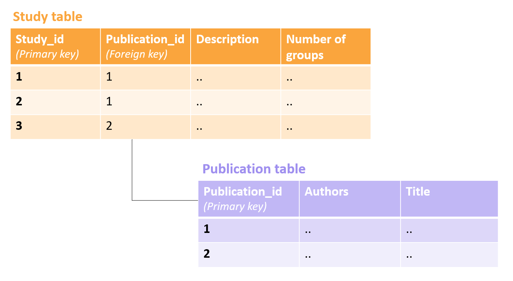
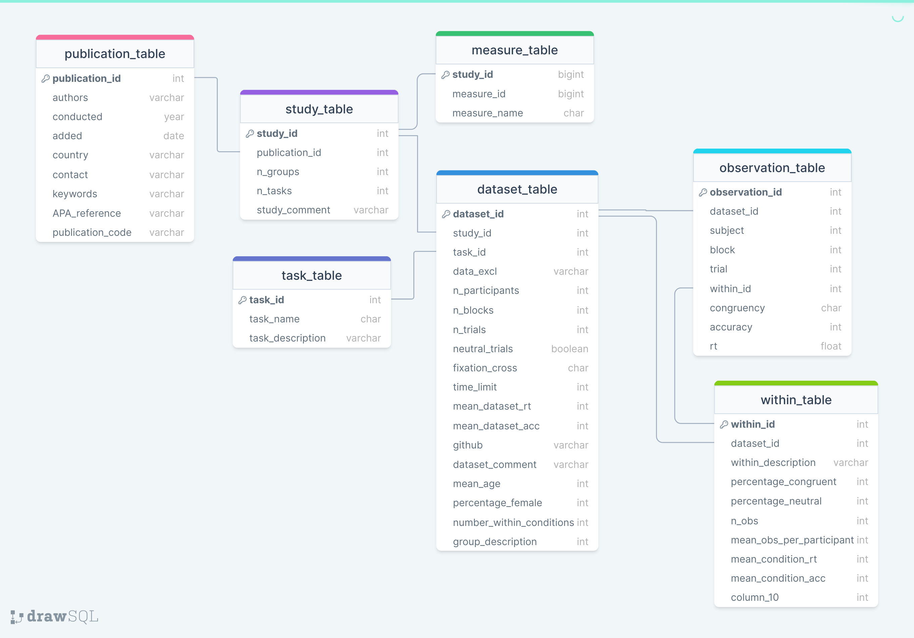

```{r setup, include = FALSE}
library("papaja")
library("acdcquery")
library("BayesFactor")
library("MCMCpack")
library("splithalf")
library("tidyverse")
library("ggplot2")
library("dplyr")

r_refs("r-references.bib")
```

```{r analysis-preferences}
# Seed for random number generation
set.seed(42)
knitr::opts_chunk$set(cache.extra = knitr::rand_seed)
```

```{r data-overview, echo = F, eval = T, cache = T, message=F, warning=F}
library(acdcquery)

dbfile <- tempfile(fileext=".sqlite") # not created yet, just a string
download.file("https://github.com/jstbcs/acdc-database/raw/main/acdc.db", dbfile)

conn <- connect_to_db(dbfile)

arguments <-  list()
arguments <- add_argument(
 list = arguments,
 conn = conn,
 variable = "study_id",
 operator = "greater",
 values = c(-1)
)

query_results <- query_db(
 conn = conn,
 arguments = arguments,
 target_vars = c("default", "publication_id", "publication_code", "task_name")
)

# head(query_results)
K <- length(unique(query_results$dataset_id))
I <- length(unique(query_results$publication_id))
n_participants <- length(unique(query_results$subject))
n_obs <- nrow(query_results)
```

Making data openly available has been a central demand by reformers since the start of the reproducibility crisis in psychology [@Nosek:etal:2015]. Fortunately, this demand has lead to a considerable increase in data availability. While only about 25% of data were shared after request in 2006 [@Wicherts:etal:2006], publicly sharing data upon publication is now more and more the norm. Between 2014 and 2021, the percentage of open data badges awarded at the journal *Psychological Science* drastically increased from 16 to 78 percent [@Bauer:2022]. This cultural shift is also increasingly institutionalized: Universities and funding agencies prioritize open data, and some journals even mandate the publication of data with every published article [@Sloman:2015]. In addition, technology like the Open Science Framework (OSF) and other data sharing services enable an easy process for researchers, further reducing barriers to share data.

Data sharing serves two goals: 1. To make the scientific process more transparent and enable error and fraud detection, and 2. to make the scientific process more efficient by allowing data reuse for different research projects. Current data sharing efforts, however, seemingly focus overwhelmingly on the first goal [@Cruewell:etal:2023; @Hardwicke:etal:2021; @Obels:etal:2020]. We argue that, as a result, current data sharing procedures do not sufficiently meet the second goal. Whenever researchers complying with common data sharing procedures publish an article, they share the corresponding data on the OSF, ideally in a format that allows to redo the exact analyses reported in the article. The OSF repository is linked in the article, and readers may access the data through this link and check whether analysis code and shared data correspond to the results section in the article. From an ethical standpoint, this process seems reasonable: Data shared through this process are often aggregated and cleaned allowing reproduction of results without sharing unnecessary details of participants' behavior. However, one may also argue that this approach is unethical - not sharing raw, unaggregated data that is easy to find and reuse, is a mismanagement of public resources and participants' time.

To enable data reuse, data sharing needs to be approached differently. Consider as an example a researcher (like the first author of the current paper) might me interested in the Stroop task [@Stroop:1935]. The Stroop task is popular in cognitive psychology [@MacLeod:1991], so we may assume that many studies include this or similar tasks in their studies. Instead of running yet another Stroop experiment, the researcher decides to use existing data to explore their research question before designing a more targeted study. First, the researcher needs to be able to find open Stroop task data. Currently, they could either search for papers on the topic and check whether open data are provided, or search directly via OSF or other data sharing servers. However, neither of these options is very promising as the vast majority of articles in the literature does not provide raw data, and data sharing servers are not equipped with sufficient search options. Second, data sets need to be accessed easily and in a general, understandable format ready for reuse. There are data sharing formats that provide this structure [@Wilkinson:etal:2016], but they are rarely used. Moreover, data are usually shared on the level necessary for the original analysis. In case of the Stroop task, researchers might share the Stroop effect per participant, but for this new analysis the researcher needs trial-level data. So again, there is yet another barrier for data reuse.

We think it is necessary to provide a data sharing solution that solves the current problems and enables easy and efficient data reuse. Here, we propose to gather open data sets from a specific research area in an SQL data base. This process requires little to no work from the authors of the original papers in addition to current data sharing policies, some work from the lab(s) setting up the data base, and little to no work from the researchers who wish to reuse open data. We describe the process and structure we used to set up a data base of attentional control tasks called the Attentional Control Data Collection (ACDC). The data base currently includes `r K` data sets from `r I` publications from tasks like the Stroop, Simon, and flanker tasks (see Appendix). Subsequently, we show how researchers can contribute their own data to the data base, how the data can be explored using a Shiny app and accessed for reuse using an `R`-package. In an example analysis, we assess the reliability of the included tasks. This section highlights how an open data base like ACDC can aid meta-analytic efforts as well as methodological innovation.

To provide a little history of the project, the Attentional Control Data Collection was inspired by a collection of open data sets from attentional control tasks by the Perception and Cognition Lab led by J. Rouder ([url](https://github.com/PerceptionCognitionLab/data0)). Colleagues provided the first author and Rouder with data sets for their statistical work [@Haaf:Rouder:2017; @Rouder:etal:2023]. To ensure that data sets were accessible, we gathered them in a github repository. However, there was little structure to the collection, and github repositories are neither stable entities nor are they designed as data storage. Here, we describe how a structured data collection can be achieved and which benefits it provides.

# SQLight Database

One of the most standard ways in computer science for storing data is using a Structured Query Language (SQL) data base. SQL allows to create, access and manipulate a structured data storage. SQL data bases consist of data tables and relations between these tables. There are many flavors of SQL data bases. Here, we decided to use an SQLight data base, a lightweight solution that allows us to store the entire data base in a single file of moderate size that can be downloaded by researchers for data reuse. In this section we describe the structure of the data base and the data currently included. Researchers who simply want to use ACDC may safely skip this section.

## Database Structure

SQL databases are composed of several data tables consisting of rows and columns. Each row in a data table has a primary key (essentially a row ID) which uniquely identifies it. To connect one table to another table in the database, tables may contain foreign keys which reference a unique row in another data table. In contrast to primary keys, these foreign keys can have duplicate values in the data table, as long as they are unique in their primary table. For instance, a study table may store information about all studies in a database where each row corresponds to a single study. Here the primary key is the study_id. We can ensure that our database links each study to the publication it was published in by adding a foreign key called publication_id to the study table. This foreign key references the unique identifier of the respective publication in a publication table. Figure \@ref(fig:figure1) illustrates the relationship between study table and publication table. While publication_id links to a single row in the publication table, it can occur several times in the study_table as there can be several studies per publication.

(ref:caption-figure1) Illustrative example of using foreign and primary keys in a SQL database.

```{r figure1, fig.cap = "(ref:caption-figure1)", out.width=350, fig.align='center'}

```

ACDC is adapted to the logic of publications consisting of one or multiple studies which in turn include one or more data sets. The whole structure of ACDC is shown in Figure \@ref(fig:figure2). A *publication table* and a *study table* contain specific information about each publication and study, respectively. Each data set within a study contains trial-level data from an attentional control task within a certain study. \readme{Re-reading my text I find this previous sentence quite confusing. Shall I just take it out or is it necessary for the reader's understanding?} If a between-subject manipulation exists, our data base contains a separate data set for each group and each task. For instance, a study in which two groups (younger and older adults) completed a Simon and a Stroop task would consist of four data sets (i.e., younger-Stroop, younger-Simon, older-Stroop, older-Simon) in the ACDC data base.

A *data set table* stores information about each data set, such as sample size, the number of within-participant manipulations, and whether a fixation cross was used. The *observation table* holds the trial-level attentional control task data (including response time and accuracy). The task type of each data set (i.e., Stroop, Simon, Flanker, negative priming, or other) and a description of which stimuli were presented in the task are documented in the *task table*.

Note that since the congruency of stimuli, i.e., whether response and stimulus attributes are compatible or incompatible, is part of every attentional control task, it is not considered a separate within-participant manipulation in this database but is per default included in the observation table. Any additional within-participant manipulations are coded in the within ID column of the observation table. Further information about each condition of each data set (such as the percentage of congruent trials, mean response time, and mean accuracy) are recorded in the *within table*.

(ref:caption-figure2) Structure of the ACDC database. Primary keys are indicated by the key symbol. References between data tables are illustrated through lines connecting columns across data tables. This overview includes the data type of each column: integers (int), numbers with decimal places (float), characters (varchar) and logical true/false values (booleans).

```{r figure2, fig.cap = "(ref:caption-figure2)"}

```

## Included Data

Up to the date of submission of the manuscript, `r K` data sets from `r I` publications are included in the database. The full list of data sets and references is provided in the Appendix. The current database includes data sets from studies with an experimental as well as a correlational focus. The data contain $10^ `r round(log10(n_obs))`$ observations collected from `r n_participants` participants.

We did not conduct a systematic search for data sets nor attempted to distribute a wider call for open data. Instead, we included the data sets that were already made available to the lab for previous projects, and added data sets from collaborators bit by bit. This approach was chosen to make the project feasible, and to first set up a working data base before large quantities of data are added.

## Contribute

We are planning to continuously add attentional control task data to our data base. Researchers seeking to improve data accessibility and citation potential are invited to submit their data and related study meta-information via our online form. 

To be eligible for the ACDC data base the data must have been collected for a published or pre-registered study using an attentional control task. \readme{Shall we define what we mean by "attentional control" exactly?} Researchers submitting the data must be allowed to publicly share them in anonymized format. Furthermore, the data files have to contain trial-level information on anonymized subject IDs, reaction time, accuracy (i.e., correct/ incorrect), and a congruency variable, indicating whether distractor stimuli were congruent, conflicting, or neutral. In case of between-subject manipulations and within-subject manipulations (besides congruency), the files should contain a between and a within variable indicating which condition a trial belonged to.

When submitting data to our online submission form, researchers will be asked to provide meta-information about the publication and study, such as descriptions of the attentional control task and the between and within manipulations. Data files can either be uploaded in openly readable data formats or as a link to a repository, such as OSF or Github.\
\readme{Shall we include the link to the website here? Or put it in the appendix?}

# Accessing the Database

One advantage of SQLite databases is that they are simply a file that can be downloaded and locally accesses by anyone. Our database is provided in a github repository.[^1] To access the database, researchers can download the file `acdc.db`, and use the SQLite tool of their choice. In addition, we build `R`-based tools to inspect, access, and select data from ACDC. We introduce these tools, a shiny app and an `R` package, subsequently.

[^1]: The newest version can be accessed via <https://github.com/jstbcs/acdc-database/blob/main/acdc.db>, the version at the time of submission can be found [here](https://github.com/jstbcs/acdc-database/blob/main/acdc.db). \readme{TODO: REPLACE WITH CURRENT COMMIT.}

## Shiny App

The easiest way to inspect the data is using our shiny app provided [here](LINKTOSHINYAPP). The app allows to inspect all data sets or select data sets with certain specification using the filter box on the left. For example, if a researcher is interested in the flanker task, they may select all flanker data sets for closer inspection. After selection, researchers can choose between an overview of the included data sets, some descriptive statistics, and descriptive plots (see Figure XXX). If they want to further analyze the data, they can download the data via the "get the data" tab, either directly as `csv` file or using the provided `R`-code.

\readme{TODO: Add screenshot from the shiny app as figure.}

Note that all descriptive statistics in the data base are aggregated across congruency conditions. This was a deliberate choice when designing the shiny app. By withholding information about the effect of interest, researches can inspect and select the data based on varying characteristics of the data set (including distributional properties), but remain unbiased as to the most relevant outcome variable. We hope that researchers can then formulate (and perhaps preregister) hypotheses about their reanalysis without much hindsight bias.

\readme{TODO: Add example descriptive plots.}

## R-Package

The R-package `acdcquery` allows a more customized, but still user-friendly interaction with the database without ever writing any SQL code themselves [@R-acdcquery]. Using three key functions, `connect_to_db()`, `add_argument()`, and `query_db()`, the package enables connecting to the database, filtering the data based on any variable, and load specified variables as a data frame into R. The `add_argument()` function allows easy specification of filter arguments. Any variable present in any table in the database may be used in the query. Users may also provide multiple arguments and control which of them should be combined using *AND* and which will be combined using *OR* logic. Users may also request any variable present in the database to be returned by the query. The package constructs one SQL query combining all query arguments and the requested variables. This SQL query will join multiple tables together if the user requests variables from multiple tables or the query selection is based on variables present in multiple tables. The query constructed by the package is optimized for speed by automatically discarding unnecessary variables, choosing efficient ways to join tables, and eliminating the need for temporary storage of query results. All arguments and requests are combined simultaneously, allowing optimal use of SQL's base optimization.

## Queries and Output

Below, we will illustrate several examples for using the database. Querying the database consists of 5 steps. Connecting to the database, specifying the filter arguments, specifying the relationship of filter arguments, specifying the target variables and finally querying the database. For the first step, the package needs to be installed from CRAN and loaded. Querying also requires that researchers download the database and establish a connection using `connect_to_db()`.

```{r package-install, echo = T, eval = F}
install.packages("acdcquery") # install package

library(acdcquery) # load package
db_filepath <- "path/to/database.db" # specify location of the db
conn <- connect_to_db(db_filepath) # establish a connection
```

The function `add_argument()` allows easy specification of the list containing query arguments.

```{r add-argument, echo = T, eval = F}
argument_list <- list() # Initialize List

# Adding the first argument, n_participants > 100
argument_list <- add_argument(
  list = argument_list, # The list to which the new argument is added
  conn = conn, # The connection to the database
  variable = "n_participants", # The variable name from any table
  operator = "greater", # greater, less, equal, between
  value = 100 
)

# Adding the second argument, task_name is either flanker or stroop
argument_list <- add_argument(
  list = argument_list,
  conn = conn,
  variable = "task_name",
  operator = "equal",
  value = c("stroop", "flanker")
)

# You can also specify your own SQL statement for more advanced control
# Adding a third argument manually, percentage_neutral > 0.1
argument_list <- add_argument(
  list = argument_list,
  conn = conn,
  statement = "SELECT within_id FROM within_table WHERE percentage_neutral > 0.1"
)
```

This argument-list now contains three separate filter-arguments. In our case, we only want those cases for which all are true. The package also allows the user to specify which arguments should be combined using *AND* or using *OR*.

```{r argument-sequence, eval = F, echo = T}
all_true <- "AND" # All arguments combined using "AND"
one_true <- "OR" # All arguments combined using "OR"

# same numbers lead to combination via OR
# different numbers combination via AND
custom <- c(1, 1, 2) # (Argument 1 OR Argument 2) AND Argument 3
```

The user can also specify which variables should be returned by the query. Here, any variable present in any table can be selected. To allow for fast queries in the case of limited involvement of multiple tables, the user can specify the table the query is centered on using the `target_table` argument of `query_db()`. In most cases, this is the observation-table containing trial data. If dataset-level data is of interest, it is wise to specify `target_table = dataset_table`. If all variables of the target table and some additional variables from other tables should be returned, simply add "default" to the vector specifying the target variables.

```{r target-vars, eval = F, echo = T}
# Trial data is of interest, also the task_name should be joined
mostly_trial_targets <- c("task_name", "dataset_id", "subject"
                          , "block", "trial", "rt", "accuracy")

# Mostly higher-level data is of interest
mostly_data_targets <- c("authors", "task_name"
                         , "n_participants", "mean_dataset_rt")

# All variables of the dataset_table + publication data
dataset_table_default <- c("default", "publication_id", "authors")
```

The argument-list, relationship of arguments, target variables and target table are then supplied to the `query_db()` function.

```{r querying, eval = F, echo = T}
trial_results <- query_db(
  conn = conn,
  arguments = argument_list,
  target_vars = mostly_trial_targets,
  target_table = "observation_table",
  argument_relation = all_true
)

dataset_results <- query_db(
  conn = conn,
  arguments = argument_list,
  target_vars = dataset_table_default, 
  target_table = "dataset_table",
  argument_relation = all_true # or any other valid specification
)
```

Additional info can be found on the package's [GitHub page](https://github.com/SLesche/acdc-query).

# Reliability of ACDC Tasks

```{r data-loading, cache = T, warning=FALSE}
# head(query_results)
get_n_unique <- function(x) length(unique(x))
datID <- get_n_unique(query_results$dataset_id)
n_obs <- table(query_results$dataset_id)
pubCode <- with(query_results, tapply(publication_code, dataset_id, first))
n_participants <- with(query_results, tapply(subject, dataset_id, get_n_unique))


dat_tab <- data_frame(pubCode, n_participants, n_obs)
dat <- query_results
```

```{r source-helper}
source("../share/helper_functions.R")
```

```{r hierarchical-modeling, cache = T, eval = T}
res <- list()
ids.sel <- 1:length(unique(dat$dataset_id))

for(i in ids.sel){
  dat_sub <- subset(dat, dataset_id == i)
  dat_sub <- subset(dat_sub, accuracy == 1)
  dat_sub <- subset(dat_sub, rt > .2)
  dat_sub <- subset(dat_sub, rt < 2.5)
  dat_sub <- subset(dat_sub, congruency %in% 1:2)
  issue <- issue.sub(dat_sub)
  dat_sub <- subset(dat_sub, !(subject %in% issue))
  
  res[[paste0("dataset_", i)]] <- genModOneTask(dat_sub)
  # print(i)
}
```

```{r get_stn, cache = T}
stn <- matrix(ncol = 3, nrow = length(ids.sel))
for(i in ids.sel){
  tmp <- res[[i]]
  stn[i, 1] <- mean(tmp$s2Theta / tmp$s2)
  stn[i, 2] <- get.I(subset(dat, dataset_id == i))
  stn[i, 3] <- get.K(subset(dat, dataset_id == i))
}
```

```{r get_splithalf, cache = T, warning=FALSE, message=FALSE, results='hide'}
res.splithalf <- matrix(ncol = 2, nrow = length(ids.sel))
for(i in ids.sel){
  dat_sub <- subset(dat, dataset_id == i)
  dat_sub <- subset(dat_sub, accuracy == 1)
  dat_sub <- subset(dat_sub, rt > .2)
  dat_sub <- subset(dat_sub, rt < 2.5)
  dat_sub <- subset(dat_sub, congruency %in% 1:2)
  issue <- issue.sub(dat_sub)
  dat_sub <- subset(dat_sub, !(subject %in% issue))
  res.splithalf[i, ] <- get.splithalf(dat_sub)
}
```

```{r all-dat-tab}
taskname <- with(query_results, tapply(task_name, dataset_id, first))
reldat <- data.frame(dataset_id = unique(dat$dataset_id)
                     , publication_code = pubCode
                     , taskname
                     , stn
                     , res.splithalf)
colnames(reldat) <- c("dataset_id", "publication_code", "task_name"
                      , "gamma", "I", "K", "splithalf", "spearman")
reldat$gamma <- round(sqrt(reldat$gamma), 3)
```

To illustrate how ACDC can be used for reanalysis, we provide an example data analysis assessing the reliability of attentional control tasks. Reliability of tasks like the Stroop task has recently been the target of much debate [e.g., @hedge2018reliability; @Rouder:Haaf:2019a; @Rouder:etal:2023; @mermet2018should; @Draheim:etal:2019]. The current analysis can be understood as an extension of to the analysis of 24 data sets conducted by @Rouder:etal:2023 (see their Table 2).

Here, we rely on methodological development by Rouder and colleagues [@Rouder:Haaf:2019a; @Rouder:etal:2023] to survey the reliability of data sets in ACDC. The authors have made suggestions to update the analysis of reliability of individual differences in cognitive tasks based on two simple observations. First, conventional measures of reliability such as the split-half reliability or intra-class correlation are not well suited for cognitive tasks as they are dependent on the number of trials. The reason for this dependency is that observed between-subjects variability of a target effect is a combination of true individual differences and sample noise. If sample noise is large, as is the case in these tasks, reliability can be drastically reduced with a small number of trials compared to a large number of trials. Second, unlike with psychometric tests, the number of trials of cognitive tasks is oftentimes chosen arbitrarily, as a matter of preference by the lab conducting the experiment, making it difficult to compare reliability across labs or across tasks [@Rouder:Haaf:2019a].

(ref:caption-reliability-plot) Reliability estimates as a function of number of trials and participants. A. The signal-to-noise ratio is independent of the (log) number of trials per condition but has a small positive correlation. B. The split-half reliability is highly correlated with the (log) number of trials per condition. C. The signal-to-noise ratio is independent of the (log) number of participants. D. The split-half reliability has a slight negative relationship with (log) number of participants due to the fact that large-participants studies commonly use a smaller number of trials per task.

```{r reliability-fig, fig.asp = .9, fig.width=5, fig.align='center', fig.cap = "(ref:caption-reliability-plot)"}
myCols <- RColorBrewer::brewer.pal(8, "Dark2")
layout(matrix(1:4, ncol = 2, byrow = T))
par(mgp = c(2, .6, 0), cex = 1, mar = c(3.5, 3.5, 1, 1), cex.axis = .9)
plot(log(reldat$K), reldat$gamma, ylim = c(0, .4)
, pch = 19, col = adjustcolor("slateblue", .8)
, axes = F
, ylab = expression("Signal-to-noise" ~ gamma)
, xlab = "Trials per condition")
axis(1, at = log(c(30, 100, 250, 800)), labels = c(30, 100, 250, 800))
axis(2, seq(0, .3, .1), las = 2)
mtext("A.", adj = .5, cex = 1.3)

plot(log(reldat$K), reldat$splithalf, ylim = c(-.1, 1)
, pch = 19, col = adjustcolor(myCols[4], .8)
, axes = F
, ylab = "Split-half reliability"
, xlab = "Trials per condition")
axis(1, at = log(c(30, 100, 250, 800)), labels = c(30, 100, 250, 800))
axis(2, seq(0, 1, .2), las = 2)
mtext("B.", adj = .5, cex = 1.3)

plot(log(reldat$I), reldat$gamma, ylim = c(0, .4), xlim = log(c(20, 650))
, pch = 19, col = adjustcolor("slateblue", .8)
, axes = F
, ylab = expression("Signal-to-noise" ~ gamma)
, xlab = "Participants")
axis(1, at = log(c(20, 50, 150, 500)), labels = c(20, 50, 150, 500))
axis(2, seq(0, .3, .1), las = 2)
mtext("C.", adj = .5, cex = 1.3)

plot(log(reldat$I), reldat$splithalf, ylim = c(-.1, 1), xlim = log(c(20, 650))
, pch = 19, col = adjustcolor(myCols[4], .8)
, axes = F
, ylab = "Split-half reliability"
, xlab = "Participants")
axis(1, at = log(c(20, 50, 150, 500)), labels = c(20, 50, 150, 500))
axis(2, seq(0, 1, .2), las = 2)
mtext("D.", adj = .5, cex = 1.3)
```

The relationship between common reliability estimates and trial number is illustrated in Figure \@ref(fig:reliability-fig)B. The figure shows the split-half reliability coefficients for all ACDC data sets as a function of the (log) number of trials per condition. The correlation between split-half-reliability and log trial number is `r apa_print(BayesFactor::correlationBF(log(reldat$K), reldat$splithalf))$full_result`. Figure \@ref(fig:reliability-fig)D shows the relationship between split-half reliability coefficients and the (log) number of participants. Theoretically, there should be no relationship. However, for purely practical reasons, many studies with a large number of participants have in turn a low number of trials. Therefore, empirically, we do find a negative relationship between the log number of participants and split-half reliability, `r apa_print(BayesFactor::correlationBF(log(reldat$I), reldat$splithalf))$full_result`.

To counter the lack of comparability of conventional reliability measures, @Rouder:etal:2023 proposed a measure of reliability that is derived from hierarchical modeling of the trial-level data. This modeling approach allows to separately estimate true individual variability and sample noise. As a result, we may determine how much true variability there is relative to variability due to sample noise. This ratio, termed $\gamma^2$, can be expressed as

$$\gamma^2 = \frac{\sigma^2_{\text{true}}}{\sigma^2_{\text{noise}}},$$

where the numerator is the true variance of individuals' effects estimated by the model, and the denominator is the trial-by-trial within-person variability. For the purpose of individual differences research, $\sigma^2_{\text{true}}$ represents the signal and $\sigma^2_{\text{noise}}$ represents noise, therefore, Rouder and colleagues labeled $\gamma^2$ as the signal-to-noise ratio. Here, we use the square-root of $\gamma^2$, $\gamma$, representing a ratio of standard deviations as researcher tend to be more familiar with standard deviations rather than variances.

(ref:caption-line-plot) Signal-to-noise ratio and reliability. A. Signal-to-noise ratio $\gamma$ for all data sets ordered from smallest to largest. B. Reliability as a function of number of trials for all data sets in ACDC. The lines represent different signal-to-noise ratios. For a fixed $\gamma$, the relationship between the number of trials per condition and the reliability is deterministic.

```{r line-plot, fig.asp = .85, fig.width=5.5, fig.align='center', fig.cap = "(ref:caption-line-plot)"}
layout(matrix(c(0, 1, 1, 0, rep(2, 4)), ncol = 4, byrow = T)
       , heights = c(.4,.6))
par(mgp = c(2.2, .7, 0), mar = c(3,4,1.5,1), cex.lab = 1.3)

plot(ids.sel, sort(sqrt(stn[, 1]))
     , col = myCols[1]
     , pch = 19, cex = 1.3
     , ylab = expression("Signal-to-noise" ~ gamma)
     , xlab = "Data set"
     , axes = F
     , xlim = c(0, length(ids.sel) + 7)
     , ylim = c(0, .4)
     )
mtext("A.", adj = .5)
axis(1, c(1, length(ids.sel)), cex.axis = 1.3)
axis(2, seq(0, .4, .1), cex.axis = 1.3, las=1)
abline(h = 1/15, col = adjustcolor(1, .8))
text(length(ids.sel) + 4, 1/15 + .02, "1/15", cex = 1.2)
abline(h = 1/9, col = adjustcolor(1, .6))
text(length(ids.sel) + 4, 1/9 + .02, "1/9", cex = 1.2)
abline(h = 1/5, col = adjustcolor(1, .4))
text(length(ids.sel) + 4, 1/5 + .02, "1/5", cex = 1.2)
abline(h = 1/3, col = adjustcolor(1, .2))
text(length(ids.sel) + 4, 1/3 + .02, "1/3", cex = 1.2)

dots = list("l" = stn[, 3], "g" = sqrt(stn[, 1]))
makeRelCoefFig(dots = dots, Var = FALSE, task = reldat$task_name)
mtext("B.", adj = .5, line = -1)

reldat_l <- subset(reldat, K > 30)
```

Figure \@ref(fig:line-plot)A. shows the signal-to-noise ratio $\gamma$ for all data sets ordered from smallest to largest. The median of $\gamma$ is $Med = `r round(median(sqrt(stn[, 1])), 2)`$ corresponding to a ratio of roughly 1 to 8.5. That is, for every unit of signal there are 8.5 units of noise. Using the ACDC data sets, we can also assess the independence of $\gamma$ from the number of trials and participants. Figure \@ref(fig:line-plot)A and C show these relationships. While there is no correlation between the log number of participants and $\gamma$, `r apa_print(BayesFactor::correlationBF(log(reldat$I), reldat$gamma))$full_result`, there is evidence for a positive relationship between the log number of trials and $\gamma$, `r apa_print(BayesFactor::correlationBF(log(reldat$K), reldat$gamma))$full_result`. However, we suspect that this dependence is in part due to the large number of data sets from the ManyLabs study by @ebersole2016many that only had 30 trials per participant and condition rendering them extremely unreliable. If these data sets are removed from the analysis, the Bayes factor between models with and without correlation coefficient is inconclusive, `r apa_print(BayesFactor::correlationBF(log(reldat_l$K), reldat_l$gamma))$full_result`. For the same data selection, the correlation between split-half reliability and number of trials is somewhat reduced but remains high, `r apa_print(BayesFactor::correlationBF(log(reldat_l$K), reldat_l$splithalf))$full_result`.

Overall, the assessment of reliability of the currently used attentional control tasks shows mixed results. Signal-to-noise ratios of these tasks tend to be around 0.1-0.2, highlighting overwhelming levels of trial-by-trial variability compared to true individual variability of congruency effects. As shown in Figure \@ref(fig:line-plot)B, here is no task type standing out with consistently higher or lower reliability. That is, there is no argument based on reliability that would make us prefer any task over another. However, the analysis can still help us plan future studies better. Figure \@ref(fig:line-plot)B shows the functional relationship between the reliability coefficient and the number of trial through the signal-to-noise ratio. For tasks with a signal-to-noise ratio around 0.2, around 100 trials per condition and person are needed for acceptable levels of reliability. For tasks with a signal-to-noise ratio around 0.1, roughly 500 trials are needed. We also see that all studies with large numbers of trials have acceptable levels of reliability. These insights match a recent finding by @Lee:etal:2023. The authors had participants go through almost 4000 trials per condition per task to assess how many trials are needed for precise estimates of individual effects. They conclude that around 400 trials per person and condition (or 800 in total) are needed for stable estimates of individual effects. From our current analysis using a larger number of studies and participants, we arrive at the same conclusion.

# Conclusion

Open data policies are required 1. to understand how many results in the literature are reproducible, and 2. to promote the reuse of data for a more efficient use of participants' time and public resources. While repositories like the Open Science Framework are well suited for the first goal, they do at this point not sufficiently address the latter goal. We argue that structured collections of open data are much more useful as they allow a larger community of researchers an easy access to a large body of data. Here, we introduced the Attentional Control Data Collection, an SQL data base for attentional control experiments. The data base is easy to access using a shiny app and an `R`-package, and is built to grow when researchers are willing to contribute their data in the future. We illustrate the structure of the data base, how it can be accessed, and which type of analyses can be conducted with such a large data collection.

The data base approach is related to meta-analysis, but different in two crucial aspects. One major disadvantage of the data base approach is that it does not represent a systematic overview, or even a representative sample of studies. To remedy this issue, researchers planning to develop an open data collection could conduct a systematic review of the literature including *all* studies with open data that meet their criteria in the data base. However, as the field only recently started sharing data, older studies would still be systematically excluded. One major advantage of the data base approach over meta-analysis is that it opens the path to much more sophisticated research questions and analysis. As the data base provides raw, unfiltered, trial-level data, we may use it for studying questions far beyond congruency effects. Potential analyses target sequential effects, computational modeling, or even methodological questions like the effect of online versus in-lab data collection on data quality. 

Finally, we hope researchers are willing to contribute data from their studies to ACDC or other open data collections. If they already share their data on the OSF, we see no disadvantage in also contributing to more structured data collection. In the best case, their data will contribute to advancing the field without requiring unnecessary additional data collection, leading to faster insights based on more data. This might also have benefits for the researchers themselves as anyone using their data will also cite the original paper.

\newpage

# References

::: {#refs custom-style="Bibliography"}
:::

\newpage

# (APPENDIX) Appendix {.unnumbered}

```{r child = "appendix.Rmd"}
```
